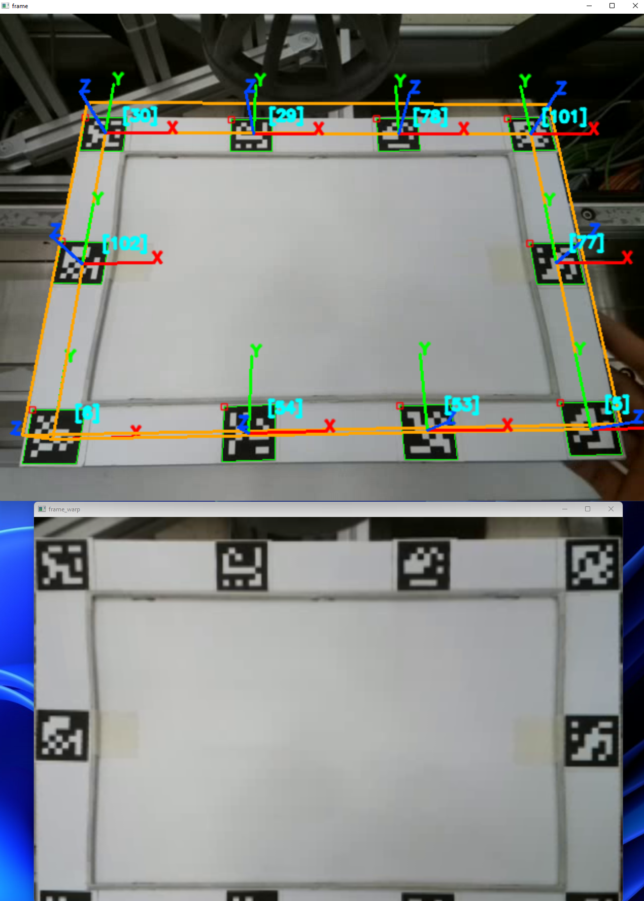

# Automatic-Workspace-Calibration-Based-on-Aruco
Detection of a plane in 3D space using aruco markers. It detects any set of tags with defined realworld positions on a json file. Then it computes projection of points on plane. It can also compute a perspective transform based on the computed homography matrix, which crops the area inside the tags placed on the corners. The volume of the computed area is defined by a 3d box that is updated with the detected tags. It uses the aruco pose estimation as initial poses for pose refinement. The more tags are detected, the better the box and area are represented.

Demo:


For the object detection code see:
 
https://github.com/david-s-martinez/Deep-Vision-System-with-5G-Edge-GPU-Server

## Features
This Python module provides a `PlanePoseEstimator` class that detects ArUco markers in a video frame, estimates their poses, and calculates the pose of a 3D plane based on detected markers. It also visualizes the detected markers and the 3D plane's coordinate axes.
- **ArUco Marker Detection**: Detects ArUco markers in an input image frame.
- **Pose Estimation**: Estimates the 3D pose (rotation and translation) of the detected markers.
- **Plane Pose Estimation**: Calculates the pose of a 3D plane using the marker information.
- **Visualization**: Draws the detected plane's origin and axes on the input frame.

---

## Installation

1. Clone this repository:
    ```bash
    git clone https://github.com/david-s-martinez/Automatic-Workspace-Calibration-Based-on-Aruco
    cd Automatic-Workspace-Calibration-Based-on-Aruco
    ```

2. Install required libraries:
    ```bash
    pip install numpy==1.22.3 opencv-contrib-python==4.5.5.64
    ```

---

## Usage

### 1. Initialize the `PlanePoseEstimator`
Ensure you have a calibrated camera and its parameters (intrinsic matrix and distortion coefficients) ready.

```python
from plane_pose_estimator import PlanePoseEstimator

# Initialize with camera parameters and other configurations
estimator = PlanePoseEstimator(
    camera_matrix=<camera_matrix>,
    camera_distortion=<camera_distortion>,
    aruco_dict=cv2.aruco.Dictionary_get(cv2.aruco.DICT_4X4_50),
    parameters=cv2.aruco.DetectorParameters_create(),
    marker_size=0.05,  # Marker size in meters
    plane_world_pts=<plane_world_pts>
)
```

### 2. Detect Tags and Compute Plane Pose
Capture a frame from your camera and pass it to the methods, by default the script will use a sample video. You can modify the code to use a camera or ip stream.

```python
cap = cv2.VideoCapture(cam_source)

while True:
    ret, frame = cap.read()
    raw_frame = frame.copy()
    
    pd.detect_tags_3D(frame)
    homography = pd.compute_homog(w_updated_pts=True, w_up_plane=True)
    frame_warp = pd.compute_perspective_trans(raw_frame, w_updated_pts=True, w_up_plane=True)
    plane_rot, plane_trans = pd.compute_plane_pose(raw_frame)

    if frame_warp is not None:
        cv2.imshow('frame_warp', frame_warp)
    
    cv2.imshow('frame', frame)
    cv2.imshow('raw_frame', raw_frame)

    key = cv2.waitKey(1) & 0xFF
    
    if key == 27:
        cap.release()
        cv2.destroyAllWindows()
        break
```
## Main Methods

### `detect_tags_3D(frame)`
- **Description**: Detects ArUco markers, estimates their poses, and updates marker vertices.
- **Args**:
  - `frame`: Image frame (numpy array).

### `compute_plane_pose(frame, w_updated_pts=False, w_up_plane=False)`
- **Description**: Computes the 3D pose of the plane.
- **Args**:
  - `frame`: Image frame (numpy array).
  - `w_updated_pts`: Use updated marker vertices (default: `False`).
  - `w_up_plane`: Use top vertices of the plane instead of the base (default: `False`).
- **Returns**: `(rvec, tvec)` or `(None, None)` if not enough points are detected.

---

## Requirements

- Python 3.9
- OpenCV (`opencv-python`, `opencv-contrib-python`)
- Numpy

---

## License

This project is licensed under the MIT License. See the LICENSE file for more details. 

